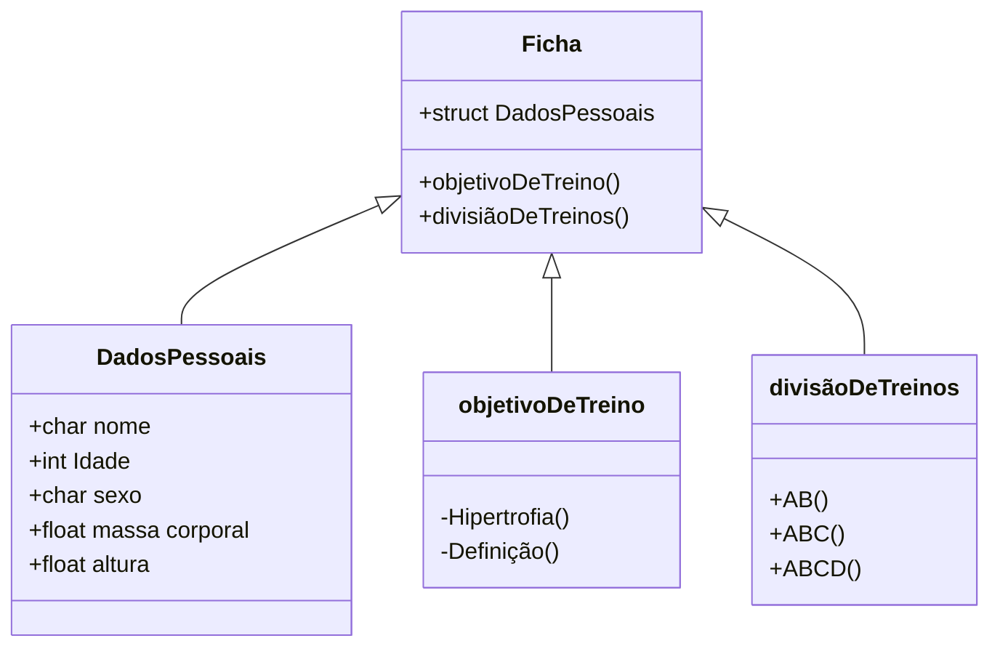

# Projeto academia em C

## **1- O que será?**

    Construção de um programa em C para montar uma ficha de treino para musculação

## **2- Como funciona uma ficha de academia?**

    Uma ficha de academia requer a inscrição do aluno contendo:  
    (Nome, Idade, sexo, massa corporal, altura, objetivo de treino, divisão de treinos)


## **3-** Estrutura de execução do programa:

    O programa consiste em um console automatizado, no qual o usuário informa se possui cadastro. 
    Caso sim, ele digitará o seu nome. Caso não, ele efetuará o cadastro para preencher todos os seus dados 
    (Nome, Idade, sexo, massa corporal, objetivo de treino, divisão de treinos).
    O atleta informará a quantidade de dias da semana que deseja treinar 
    Após o cadastro ser completado(ou já existir o cadastro), o programa iniciará o dia de treino.

    
    Os dias de treino começarão sempre pelo dia A, seguido por dia B, dia C e dia D. Obrigatoriamente nessa ordem. 
                Exemplo:
                Em tipos de treino AB: Segunda (A), Terça(B), Quarta(A), Quinta(B), Sexta(A), Sábado(B), Domingo(A);
                Em tipos de treino ABC: Segunda (A), Terça(B), Quarta(C), Quinta(A), Sexta(B), Sábado(C), Domingo(A);
                    (alterando subsequentemente os proximos dias);
                Em tipos de treino ABCD: Segunda (A), Terça(B), Quarta(C), Quinta(D), Sexta(A), Sábado(B), Domingo(C);
                    (alternando subsequentemente os próximos dias);

    A cada três dias, o atleta informará novamente sua massa corporal. (input de informação, float)
    
    E a cada fim de treino, 
    o atleta poderá informar em quais exercícios encontrou facilidade na execução das séries,
    para efetuar a progressão de cargas:  
    aumento de: 5% para membros superiores, 10% para membros inferiores. Sendo adicionadas ao registro de carga
    de cada exercício do banco de dados de cada aluno específicamente. 
```mermaid    
    flowchart TB
    subgraph Menu
    direction TB
    Start ==> id1[print: Bem vindo ao sistema automatizado de treino de musculação]
    id1 ==> id2(Insira seu código de cadastro ou digite 0 para criar um novo)
    id2 ==>id3
    id3[/Input: *numero de cadastro* ou 0 para novo cadastro/]
    end
    id3 ==> id4
    id4{{Verificação de banco de dados pré-existente}}
    b -..- id4
   
    id4 ==verificaçao==> id14((teste))
   
   
   id14==> id5
   subgraph Dados
    id5{Registro de novo cadastro}
    id5 ==> id6   
    id6[/input: Armazenamento de dados em struct\]
    b[(Dados do usuário em Struct)]
    id6 -.-> id8 & id9 & id10 & id11 & id12
    id8 -.-> b
    id9 -.-> b
    id10 -.-> b
    id11 -.-> b
    id12 -.-> b
    end
  
    
    id8[/Input: +char Nome/]
    id9[/Input: +int idade/]
    id10[/Input: +char sexo/]
    id11[/Input: +float.1f massa corporal/]
    id12[/Input: +float.2f altura/]
     
    id4 ==> id13((Preenchido)) 

    
    
        id13 =======> id20(((_)))
     subgraph Ficha de treino AB
     id20 -.-> id15 & id16
     id15[*Ficha de treino AB*\n\n Treino A \n\nAquecimento_10mins\n Chest press_4x12 \n Cruxifixo reto com halters_4x10 \n Desenvolvimento halter sentado_4x10 \n Elevação lateral_4x10 \n Leg press 45_4x12 \n Cadeira extensora_4x12 \n Pulley Triceps_4x12]
     id16[*Ficha de treino AB*\n\n Treino B \n\nAquecimento_10mins\n Pulley anterior aberto_4x12 \n Remada curvada unilateral_4x12 \n Encolhimento halter_4x10 \n Mesa Flexora_4x12 \n Cadeira Flexora_4x10 \n Cadeira abdutora_4x12 \n Rosca direta barra em W_4x10 \n  Panturrilha leg press_4x12 \n Abdominal elevação quadril_4x10]
     
         end
    
   
        id13 ======> id21((_))
        id21-.-> id17 & id22
         
        subgraph Ficha de treino ABC
      id17[Ficha de treino ABC]
      id22[Ficha de treino ABC]
    end
    
    
        id13 =======> id18{{Ficha de treino ABCD}}
    subgraph Ficha de treino ABCD
    id18[Ficha de treino ABCD]
    end
    
    
 ```

        
        

                
