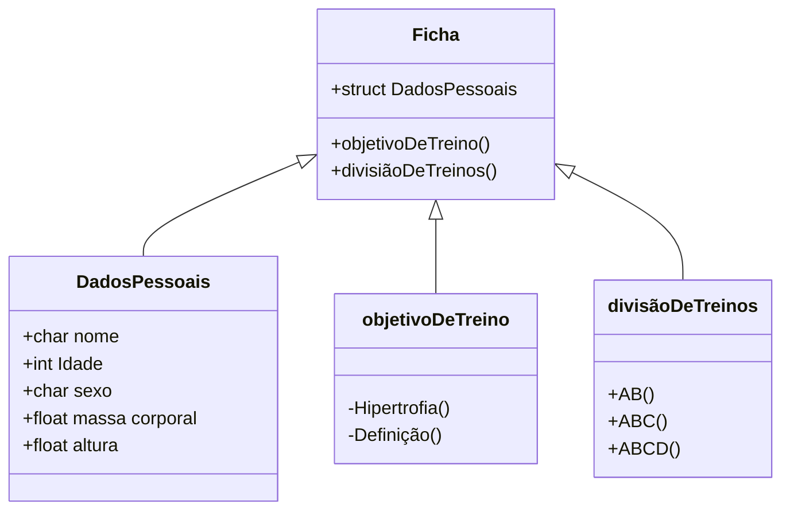

# Projeto academia em C

## **1- O que será?**

    Construção de um programa em C para montar uma ficha de treino para musculação

## **2- Como funciona uma ficha de academia?**

    Uma ficha de academia requer a inscrição do aluno contendo:  
    (Nome, Idade, sexo, massa corporal, altura, objetivo de treino, divisão de treinos)


## **3-** Estrutura de execução do programa:

    O programa consiste em um console automatizado, no qual o usuário informa se possui cadastro. 
    Caso sim, ele digitará o seu nome. Caso não, ele efetuará o cadastro para preencher todos os seus dados 
    (Nome, Idade, sexo, massa corporal, objetivo de treino, divisão de treinos).
    O atleta informará a quantidade de dias da semana que deseja treinar 
    Após o cadastro ser completado(ou já existir o cadastro), o programa iniciará o dia de treino.

    
    Os dias de treino começarão sempre pelo dia A, seguido por dia B, dia C e dia D. Obrigatoriamente nessa ordem. 
                Exemplo:
                Em tipos de treino AB: Segunda (A), Terça(B), Quarta(A), Quinta(B), Sexta(A), Sábado(B), Domingo(A);
                Em tipos de treino ABC: Segunda (A), Terça(B), Quarta(C), Quinta(A), Sexta(B), Sábado(C), Domingo(A);
                    (alterando subsequentemente os proximos dias);
                Em tipos de treino ABCD: Segunda (A), Terça(B), Quarta(C), Quinta(D), Sexta(A), Sábado(B), Domingo(C);
                    (alternando subsequentemente os próximos dias);

   
```mermaid    
    flowchart TB
        classDef default fill:#404040,stroke:#B3B3B3,stroke-width:3px;   
           

    subgraph Menu
    direction TB
    Start ==> id1[print: Bem vindo ao sistema automatizado de treino de musculação]
    id1 ==> id2(Insira seu código de cadastro ou digite 0 para criar um novo)
    id2 ==>opçãocadastro
    opçãocadastro[/Input: *numero de cadastro* ou 0 para novo cadastro/]
    end
    opçãocadastro ==> verificaçãodados
    verificaçãodados{{Verificação de banco de dados pré-existente}}
    dadosstruct -..- verificaçãodados
   
    verificaçãodados ==verificaçao==> teste
    
      teste==> novocadastro
   subgraph Dados
    novocadastro{Registro de novo cadastro}
    novocadastro ==> inputdados   
    inputdados[/input: Armazenamento de dados em struct\]
    dadosstruct[(Dados do usuário em Struct)]
    inputdados -.-> nome & idade & sexo & massacorporal & altura
    nome -.-> dadosstruct
    idade -.-> dadosstruct
    sexo -.-> dadosstruct
    massacorporal -.-> dadosstruct
    altura -.-> dadosstruct
    end

    nome[/Input: +char Nome/]
    idade[/Input: +int idade/]
    sexo[/Input: +char sexo/]
    massacorporal[/Input: +float.1f massa corporal/]
    altura[/Input: +float.2f altura/]

    verificaçãodados ==> preenchido((Preenchido)) 
             subgraph Loop  
             direction TB
                preenchido =======> conectoriniciante((_))
             subgraph Ficha de treino AB \n iniciante
        
            subgraph sequencia iniciante  
            direction LR 
            
                inicianteA((A = 0))
                inicianteB((B = 1))
               
                end
             conectoriniciante -.-> iniciantetreinoA & iniciantetreinoB
             iniciantetreinoA[*Ficha de treino AB*\n\n Treino A \n\nAquecimento_10mins\n Chest press_4x12 \n Cruxifixo reto com halters_4x10 \n Desenvolvimento halter sentado_4x10 \n Elevação lateral_4x10 \n Leg press 45_4x12 \n Cadeira extensora_4x12 \n Pulley Triceps_4x12]
             iniciantetreinoB[*Ficha de treino AB*\n\n Treino B \n\nAquecimento_10mins\n Pulley anterior aberto_4x12 \n Remada curvada unilateral_4x12 \n Encolhimento halter_4x10 \n Mesa Flexora_4x12 \n Cadeira Flexora_4x10 \n Cadeira abdutora_4x12 \n Rosca direta barra em W_4x10 \n  Panturrilha leg press_4x12 \n Abdominal elevação quadril_4x10]
             iniciantetreinoA-.-> inicianteA
            inicianteA -.-> quartainiciante & sextainiciante
            inicianteA --> segundainiciante
            iniciantetreinoB -.-> inicianteB
            inicianteB -.->terçainiciante & quintainiciante & sabadoiniciante
            
            
            
            subgraph Dias iniciante
            direction LR 
            segundainiciante[segunda]
            terçainiciante[terça]
            quartainiciante[quarta]
            quintainiciante[quinta]
            sextainiciante[sexta]
            sabadoiniciante[sabado]
            
          
              
           end
            segundainiciante ==> terçainiciante ==> quartainiciante ==> quintainiciante ==> sextainiciante ==> sabadoiniciante ==> domingoiniciante
              
                 subgraph Dia de descanso 
              direction RL 
              domingoiniciante{{C = Dia reset}}
              domingoiniciante == Reset ==> inicianteA 
                end
                 end
                 
         
         preenchido ======> conectorintermediario((_))
                conectorintermediario-..-> intermediariotreinoA & intermediariotreinoB & intermediariotreinoC
                
                subgraph Ficha de treino ABC \n  Intermediário
                direction TB
                conectorintermediario((_))
                subgraph sequencia intermediario
                        direction TB  
                        
                        intermediario1((B = 1))
                        intermediario0((A = 0))
                        
                        intermediario2((C = 2))
                        
                    end 
                
                subgraph Dias intermediario
                direction RL
                        segundaintermediario[segunda]
                        terçaintermediario[terça] 
                        quartaintermediario[quarta]
                        quintaintermediario[quinta]
                        sextaintermediario[sexta]
                        sabadointermediario[sabado]
                        domingointermediario[domingo descanso]
                        segundaintermediario ===> terçaintermediario ===> quartaintermediario ===> quintaintermediario ===> sextaintermediario ===> sabadointermediario ===> domingointermediario         
                       end
                        
                       subgraph \n\ndia de descanso
                       intermediario3{{D = Dia Reset}}     
                       
                       end
                         
                            
              intermediariotreinoA[Ficha de treino ABC \n\n Treino A \n\n Supino reto com barra_3x6\n Supino inclinado com halteres_3x8 \n Cruxifixo na polia_3x10 \n Desenvolvimento com halteres_3x6 \n Elevação lateral na polia_3x10 \n Tríceps corda_3x10 \n Rosca francesa_3x12]
              intermediariotreinoB[Ficha de treino ABC \n\n Treino B \n\n Barra fixa3x6-8 \n Remada curvada_3x8-10 \n Pull Down_3x10-12 \n Encolhimento com barra_3x6-8 \n Cruxifixo invertido na polia_3x10 \n Rosca direta_3x10 \n  Rosca inversa_3x12]
              intermediariotreinoC[Ficha de treino ABC \n\n Treino C \n\n Agachamento livre_3x6-8 \n Leg press_3x8-10 \n Stiff_3x10-12 \n Passada_3x8x2 \n Mesa flexora_3x10-12 \n Cadeira extensora_3x10 \n Panturrilhas em pe_3x12-15 \n Panturrilhas sentada]
              
              intermediariotreinoA -...-> intermediario0
              intermediariotreinoB -...-> intermediario1
              intermediariotreinoC -...-> intermediario2
              domingointermediario -...-> intermediario3
              
              intermediario0 -.-> segundaintermediario
              intermediario1 -.-> terçaintermediario
              intermediario2 -.-> quartaintermediario
              intermediario0 -.-> quintaintermediario
              intermediario1 -.-> sextaintermediario
              intermediario2 -.-> sabadointermediario
              intermediario3 == Reset ==> intermediario0 
                    
                end  
             
                        
                   preenchido =======> conectoravançado((_)) 
                   
                     
                   subgraph Ficha de treino ABCD \n avançado 
                       avançadotreinoA{{Ficha de treino ABCD}}
                       conectoravançado -.-> avançadotreinoA & avançadotreinoB & avançadotreinoC & avançadotreinoD
                                avançadotreinoA[Ficha de treino ABCD \n\n Treino A \n\n Supino inclinado c/ barra4x10-12 \n Cruxifixo reto_3x10-12 \n Supino reto c/ barra_3x10x12 \n Voador_3x10-12 \n Francês deitado c/ halteres_3x10-12 \n Corda Cross_4x10-12 \n Tríceps testa 4x10-12]
                                avançadotreinoB[Ficha de treino ABCD \n\n Treino B \n\n Supino inclinado c/ barra4x10-12 \n Cruxifixo reto_3x10-12 \n Supino reto c/ barra_3x10x12 \n Voador_3x10-12 \n Francês deitado c/ halteres_3x10-12 \n Corda Cross_4x10-12 \n Tríceps testa 4x10-12]
                                avançadotreinoC[Ficha de treino ABCD \n\n Treino C \n\n Supino inclinado c/ barra4x10-12 \n Cruxifixo reto_3x10-12 \n Supino reto c/ barra_3x10x12 \n Voador_3x10-12 \n Francês deitado c/ halteres_3x10-12 \n Corda Cross_4x10-12 \n Tríceps testa 4x10-12]
                                avançadotreinoD[Ficha de treino ABCD \n\n Treino C \n\n Supino inclinado c/ barra4x10-12 \n Cruxifixo reto_3x10-12 \n Supino reto c/ barra_3x10x12 \n Voador_3x10-12 \n Francês deitado c/ halteres_3x10-12 \n Corda Cross_4x10-12 \n Tríceps testa 4x10-12]
                                       
                                end
                                   
                                   subgraph sequencia avançado
                                   
                                   avançadotreinoA -.-> avançado0
                                      avançadotreinoB -.-> avançado1
                                      avançadotreinoC -.-> avançado2  
                                      avançadotreinoD -.-> avançado3 
                                   avançado0((A = 0))
                                        avançado1((B = 1))
                                        avançado2((C = 2))
                                        avançado3((D = 3))
                                        end 
                                   
                                       
                                    subgraph Dias avançado
                                    avançado0 -..-> segundaavançado[Segunda]
                                    avançado1 -..-> terçaavançado[Terça]
                                    avançado2 -..-> quartaavançado[Quarta]
                                    avançado3 -..-> quintaavançado[Quinta]
                                    avançado0 -..-> sextaavançado[Sexta]
                                    avançado2 -..-> sabadoavançado[Sábado]
                                     end
                                     
                                     segundaavançado ===> terçaavançado===> quartaavançado ===> quintaavançado ===> sextaavançado ===> sabadoavançado ===> domingoavançado
                                        
                                        subgraph Dia de descanso
                                            domingoavançado[6º dia de treino da semana] 
                                            domingoavançado ==> avançado4{{E = Dia Reset}} 
                                            avançado4 == Reset ==> avançado0
                                            
                                                end
                           
              end
                
       
 ```

        
        

                
