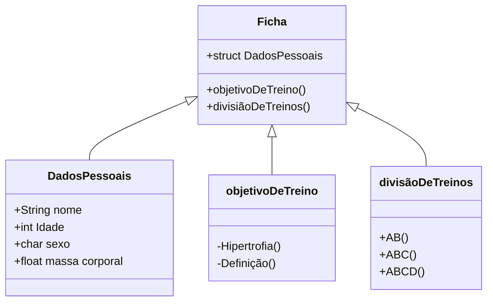

# Projeto academia em C

## **1- O que será?**

    Construção de um programa em C para montar uma ficha de treino para musculação

## **2- Como funciona uma ficha de academia?**

    Uma ficha de academia requer a inscrição do aluno contendo:  
    (Nome, Idade, sexo, massa corporal, objetivo de treino, divisão de treinos)


## **3-** Estrutura de execução do programa:

    O programa consiste em um console automatizado, no qual o usuário informa se possui cadastro. 
    Caso sim, ele digitará o seu nome. Caso não, ele efetuará o cadastro para preencher todos os seus dados 
    (Nome, Idade, sexo, massa corporal, objetivo de treino, divisão de treinos).
    O atleta informará a quantidade de dias da semana que deseja treinar 
    Após o cadastro ser completado(ou já existir o cadastro), o programa iniciará o dia de treino.

    
    Os dias de treino começarão sempre pelo dia A, seguido por dia B, dia C e dia D. Obrigatoriamente nessa ordem. 
                Exemplo:
                Em tipos de treino AB: Segunda (A), Terça(B), Quarta(A), Quinta(B), Sexta(A), Sábado(B), Domingo(A);
                Em tipos de treino ABC: Segunda (A), Terça(B), Quarta(C), Quinta(A), Sexta(B), Sábado(C), Domingo(A);
                    (alterando subsequentemente os proximos dias);
                Em tipos de treino ABCD: Segunda (A), Terça(B), Quarta(C), Quinta(D), Sexta(A), Sábado(B), Domingo(C);
                    (alternando subsequentemente os próximos dias);

    A cada três dias, o atleta informará novamente sua massa corporal. (input de informação, float)
    
    E a cada fim de treino, 
    o atleta poderá informar em quais exercícios encontrou facilidade na execução das séries,
    para efetuar a progressão de cargas:  
    aumento de: 5% para membros superiores, 10% para membros inferiores. Sendo adicionadas ao registro de carga
    de cada exercício do banco de dados de cada aluno específicamente. 
```Mermaid    
    flowchart TD
    Start ==> id1[print: Bem vindo ao sistema automatizado de treino de musculação]
    id1 ==> id2(Insira seu código de cadastro ou digite 0 para criar um novo)
    id2 -->id3
    id3[/Input: *numero de cadastro* ou 0 para novo cadastro/]
    id3 --> id4
    id4(Verificação de cadastro)
    id4 --> id5
    id5{Registro de novo cadastro}
    id5 ==> |sim| id6   
    id5 ==> |não| id7
    id6[/input: Armazenamento de dados em struct\]
    id7(Verificação )
        

                
